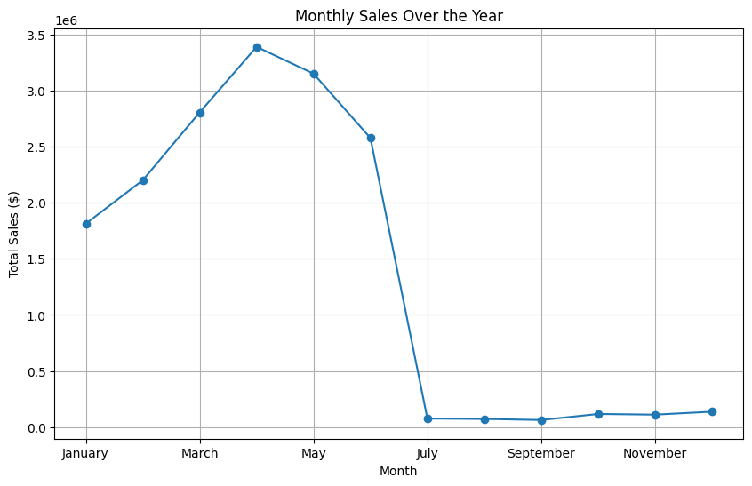
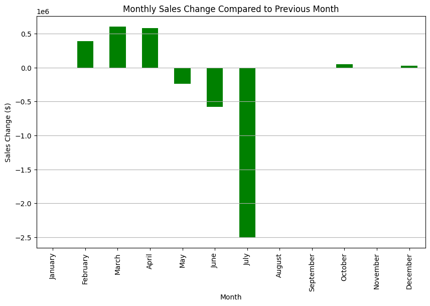

# **Business Insights Amplification Using PowerBI** 

## Table of Contents
1. [Introduction](#introduction)
2. [Business Understanding](#business-understanding)
3. [Data Understanding](#data-understanding)
   - [Loading Datasets and Exploratory Data Analysis (EDA)](#loading-datasets-and-exploratory-data-analysis-eda)
   - [Feature Engineering](#Feature-Engineering)
4. [Deriving Business Insights] (#Deriving-Business-Insights)
   - [Answering the business question] (#Answering-Business-Questions)  
5. [PowerBi Deployment](#Powerbi-Deployment)
7. [Conclusion](#conclusion)

## Introduction
This project focuses on leveraging PowerBI to enhance insights for an electronic store. By analyzing business data, the goal is to create an impactful PowerBI dashboard that provides a comprehensive overview of the store's performance, answers crucial questions, and aids in data-driven decision-making.

## Business Understanding
In this section, we explore the unique aspects of the electronic store business, including objectives, problem statements, and identification of stakeholders. This understanding sets the stage for our data exploration and analysis.

## Data Understanding
### Loading Datasets and Exploratory Data Analysis (EDA)
We kick off the project by importing necessary dependencies, loading electronic store datasets, and conducting an Exploratory Data Analysis (EDA). This step reveals insights into sales patterns, customer behaviors, and product popularity.

### Feature Engineering
Feature engineering involved creating new columns such as Total sales, categorizing products, and cleaning data specific to an electronic store context. This step ensured the dataset is optimized for in-depth analysis.

## Deriving Business Insights
### Answering Business Questions
Critical business questions related to electronic store operations are addressed. Insights into product performance, sales trends, and customer preferences are extracted to inform strategic decisions.

#### Screenshots

#### Screenshots

## PowerBi Deployment
Insights derived from the analysis are translated into an impactful PowerBI dashboard. The PowerBI deployment section guides users on accessing the dashboard, visualizing key metrics, and gaining a deeper understanding of the electronic store's performance.

## Conclusion
The project concludes with a comprehensive analysis of electronic store data, highlighting key findings and insights. The PowerBI dashboard serves as a valuable tool for stakeholders in the electronic store to make informed decisions and drive business growth.
